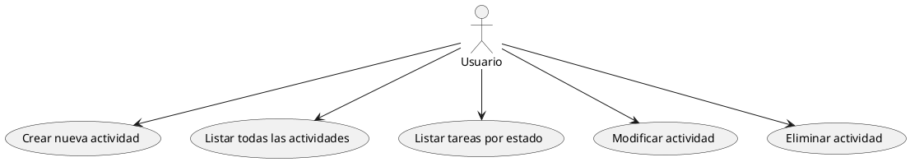

### **Diagrama de Casos de Uso - Gestor de Tareas y Eventos**

Este diagrama representa las **funcionalidades principales** del sistema de gestión de tareas y eventos en un proyecto colaborativo, implementado en **Kotlin**.

---

### **📌 Descripción del Sistema**

El sistema permite a un **usuario** gestionar actividades mediante una **interfaz de consola**. Las funcionalidades clave incluyen la creación, modificación, consulta y eliminación de actividades.

**🎭 Actor Principal:**
- **Usuario**: Interactúa con la aplicación para gestionar tareas y eventos.

**🛠️ Funcionalidades Representadas:**
1. **Crear nueva actividad** (Tarea o Evento).
2. **Listar todas las actividades** registradas en el sistema.
3. **Listar tareas según su estado** (ABIERTA o CERRADA).
4. **Modificar actividad** para actualizar su información.
5. **Eliminar actividad** del sistema.

---

### **📌 Código en PlantUML (Versión Final)**

---

### **🎯 Explicación del Diagrama**

✔ **Estructura sencilla y clara**, mostrando exclusivamente las funcionalidades del sistema.  
✔ **Todas las interacciones** están asociadas al actor principal (**Usuario**).  
✔ **Cada caso de uso representa una acción directa** dentro del sistema de gestión de actividades.
