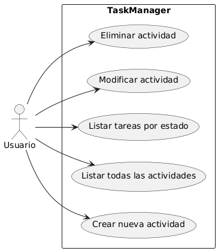
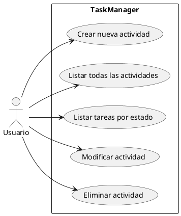
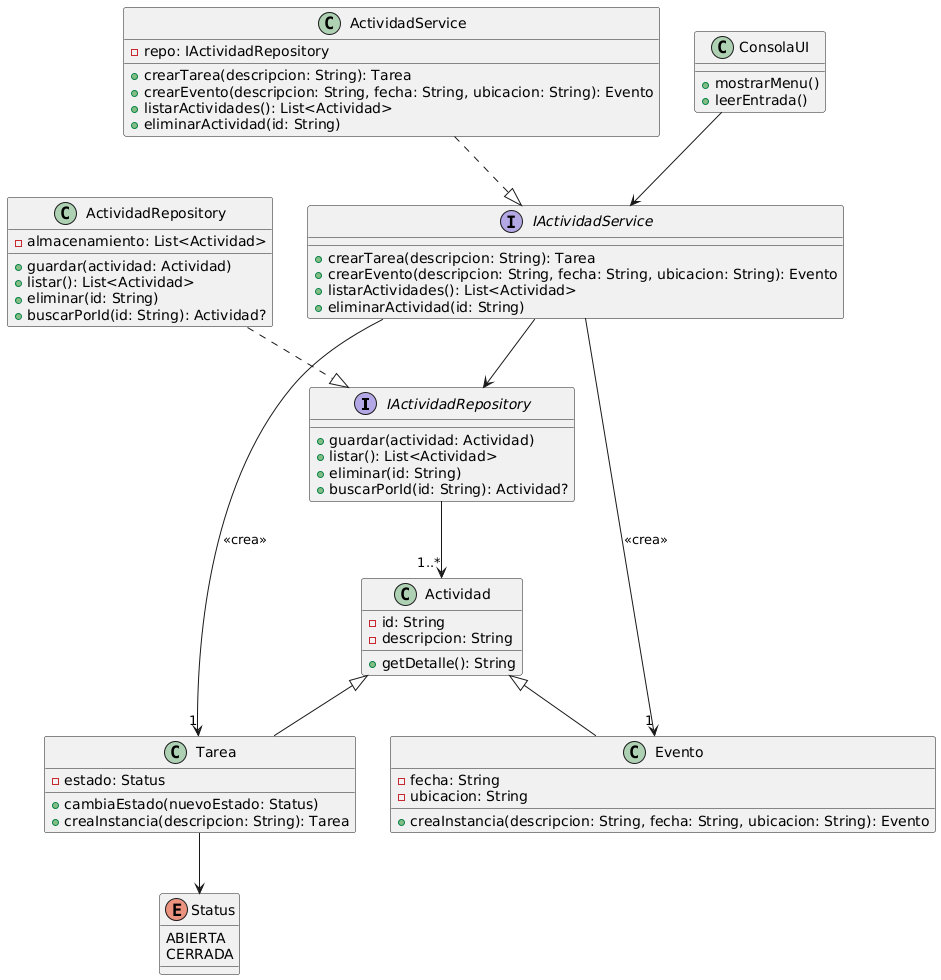
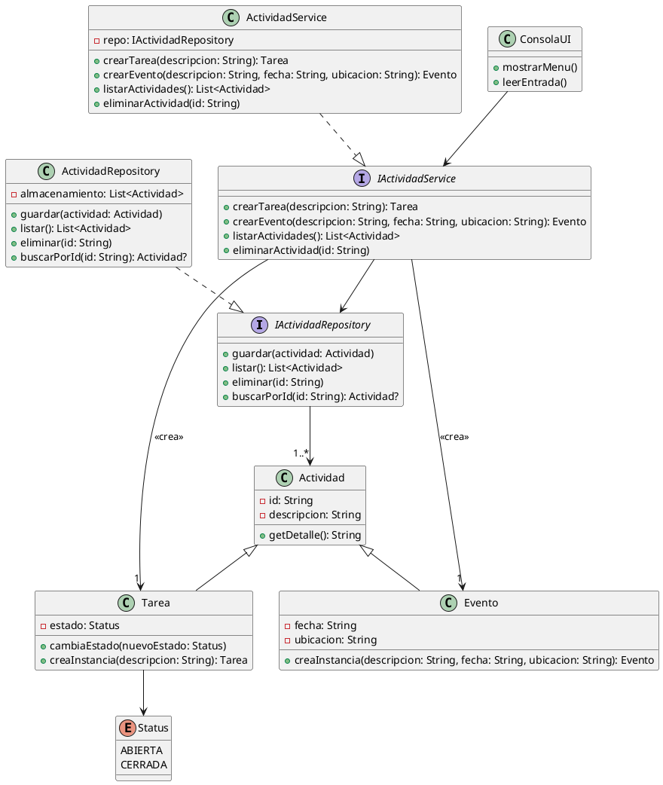
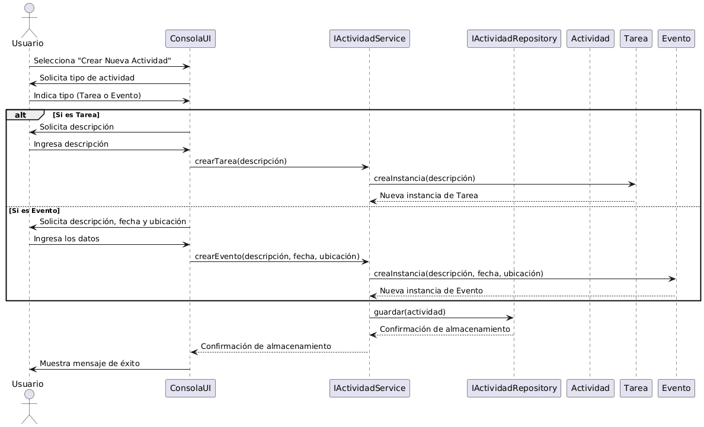
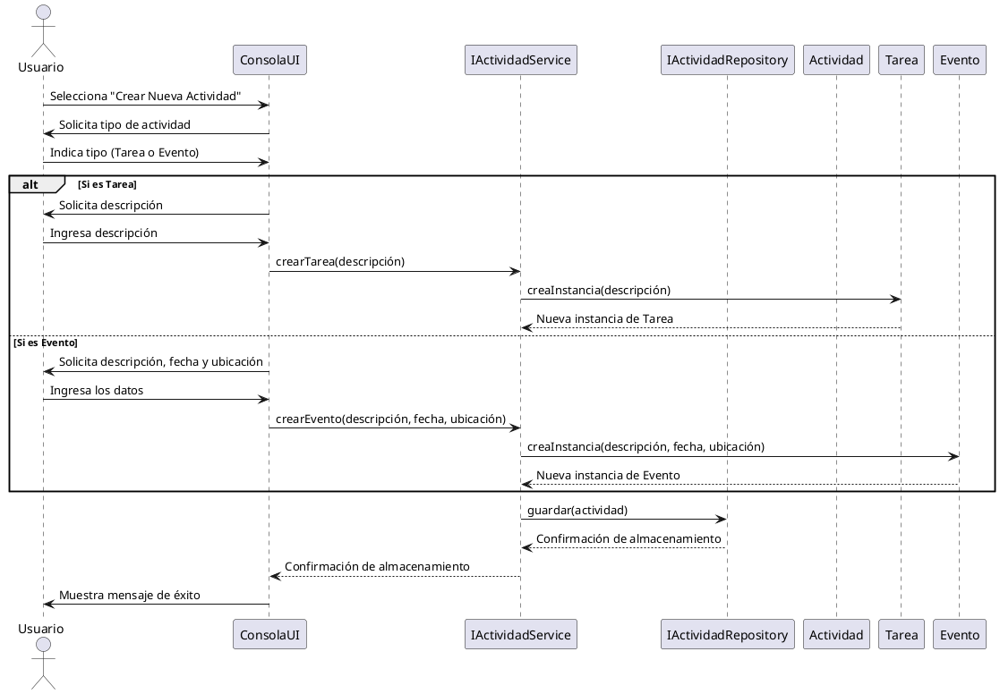
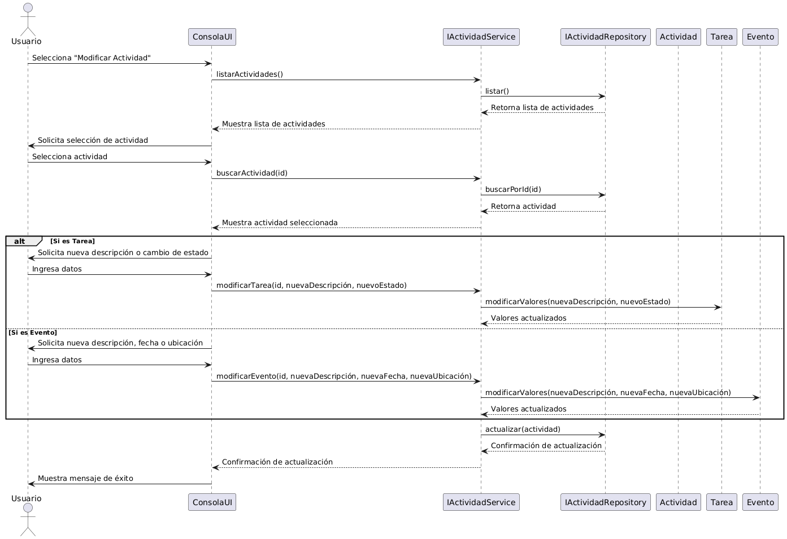
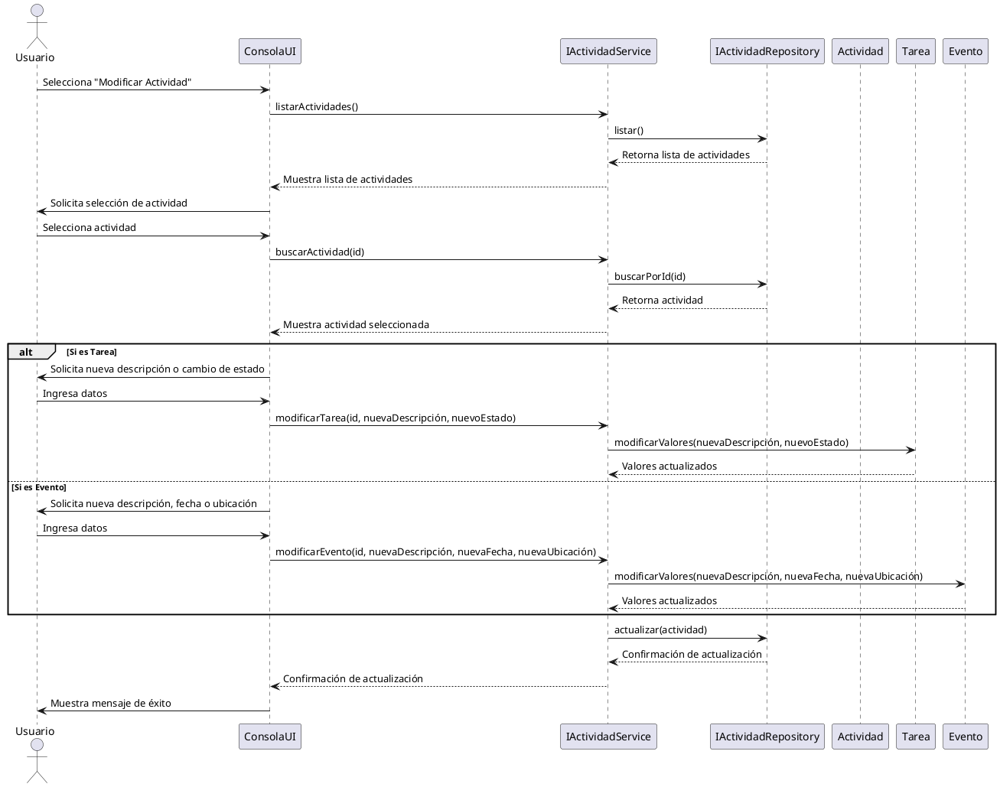
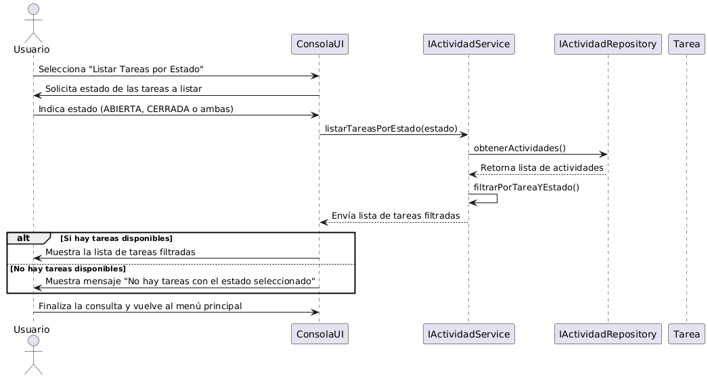
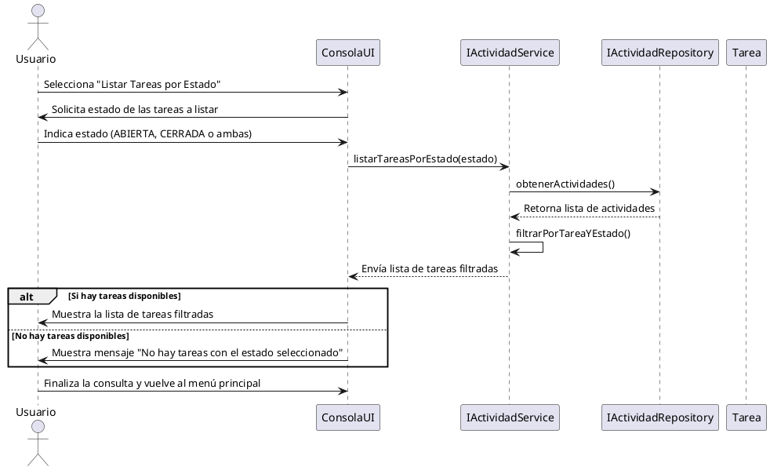

## Diagrama de Casos de Uso - Gestor de Tareas y Eventos

Este diagrama representa las **funcionalidades principales** del sistema de gestión de tareas y eventos en un proyecto colaborativo, implementado en **Kotlin**.

---

### **📌 Descripción del Sistema**

El sistema permite a un **usuario** gestionar actividades mediante una **interfaz de consola**. Las funcionalidades clave incluyen la creación, modificación, consulta y eliminación de actividades.

**🎭 Actor Principal:**
- **Usuario**: Interactúa con la aplicación para gestionar tareas y eventos.

**🛠️ Funcionalidades Representadas:**
1. **Crear nueva actividad** (Tarea o Evento).
2. **Listar todas las actividades** registradas en el sistema.
3. **Listar tareas según su estado** (ABIERTA o CERRADA).
4. **Modificar actividad** para actualizar su información.
5. **Eliminar actividad** del sistema.

---

### **📌 Diagrama de Casos de uso**

---

## Diagrama de clases  - Gestor de Tareas y Eventos 

✔ **Estructura sencilla y clara**, mostrando exclusivamente las funcionalidades del sistema.  
✔ **Todas las interacciones** están asociadas al actor principal (**Usuario**).  
✔ **Cada caso de uso representa una acción directa** dentro del sistema de gestión de actividades.

### **Diagrama de Clases**

Este diagrama representa la estructura del sistema, aplicando **principios SOLID** y asegurando una separación clara entre presentación, lógica de negocio y acceso a datos.

---

### **📌 Descripción de la Solución**

El sistema se basa en una **arquitectura en capas**, separando responsabilidades mediante **interfaces** para facilitar la escalabilidad y el mantenimiento del código.

#### **1️⃣ Clases Principales**
- **`Actividad`**: Clase base que representa una actividad en el sistema.
- **`Tarea`**: Hereda de `Actividad`, incluye un estado (`ABIERTA`, `CERRADA`).
- **`Evento`**: Hereda de `Actividad`, tiene fecha y ubicación.

#### **2️⃣ Lógica de Aplicación**
- **`IActividadService`**: Interfaz que define las operaciones del servicio.
- **`ActividadService`**: Implementación de `IActividadService`, gestiona la creación y consulta de actividades.

#### **3️⃣ Acceso a Datos**
- **`IActividadRepository`**: Interfaz que define las operaciones de almacenamiento.
- **`ActividadRepository`**: Implementación en memoria de `IActividadRepository`.

#### **4️⃣ Interfaz de Usuario**
- **`ConsolaUI`**: Maneja la interacción con el usuario.

---

### **📌 Diagrama de clases**

Aquí tienes el **diagrama de clases final**, que incorpora todas las relaciones correctamente y sigue los **principios SOLID**, asegurando una separación clara de responsabilidades.

---

### **📌 Explicación de la Solución**

#### **1️⃣ Clases Principales**
✔ **`Actividad`** → Clase base para `Tarea` y `Evento`.  
✔ **`Tarea`** → Hereda de `Actividad`, incluye estado (`ABIERTA` o `CERRADA`).  
✔ **`Evento`** → Hereda de `Actividad`, incluye fecha y ubicación.  
✔ **`Status`** → Enum para los estados de una `Tarea`.

#### **2️⃣ Lógica de Negocio**
✔ **`IActividadService`** → Interfaz que define las operaciones del servicio.  
✔ **`ActividadService`** → Implementación de `IActividadService`, maneja la creación y consulta de actividades.

#### **3️⃣ Persistencia de Datos**
✔ **`IActividadRepository`** → Interfaz que define las operaciones de almacenamiento.  
✔ **`ActividadRepository`** → Implementación en memoria de `IActividadRepository`.

#### **4️⃣ Interfaz de Usuario**
✔ **`ConsolaUI`** → Maneja la interacción con el usuario.

---

### **📌 Relaciones Clave**

📌 **Relación entre `IActividadRepository` y `Actividad`**
- `IActividadRepository` gestiona **múltiples actividades** (`1..*`).

📌 **Relación entre `IActividadService` y `Tarea`/`Evento`**
- `IActividadService` **crea** instancias de `Tarea` y `Evento`.

📌 **Dependencias Correctamente Definidas**
- `ConsolaUI` **depende de** `IActividadService` (no de la implementación concreta).
- `ActividadService` **depende de** `IActividadRepository`, aplicando **inversión de dependencias**.

---

## Descripción del Caso de Uso: "Crear Nueva Actividad"

Este caso de uso describe **cómo un usuario interactúa con el sistema** para **crear una nueva actividad**, que puede ser una **Tarea** o un **Evento**.

---

### **Flujo de Interacción entre el Usuario y el Sistema**

1. **El usuario accede al sistema** y selecciona la opción para **crear una nueva actividad**.
2. **El sistema solicita al usuario que elija el tipo de actividad**:
    - Si elige **Tarea**, el sistema le solicita una descripción.
    - Si elige **Evento**, el sistema le solicita la descripción, la fecha y la ubicación.
3. **El usuario introduce los datos requeridos**.
4. **El sistema valida los datos ingresados**:
    - Si los datos son incorrectos, muestra un mensaje de error y vuelve a solicitar los datos.
    - Si los datos son correctos, procede con la creación de la actividad.
5. **El sistema crea la actividad** y la **almacena** en su repositorio de actividades.
6. **El sistema confirma la creación** de la actividad mostrando un mensaje de éxito al usuario.

---

### **📌 Diagrama de Secuencia

Aquí tienes el **diagrama de secuencia** que representa la interacción entre el usuario y el sistema al crear una nueva actividad:

---

### **📌 Interpretación del Diagrama de Secuencia**

#### **Actores y Componentes**
- **Usuario** → Interactúa con la interfaz de consola para crear una actividad.
- **ConsolaUI** → Muestra opciones y recibe los datos del usuario.
- **IActividadService** → Abstracción del servicio que gestiona actividades.
- **IActividadRepository** → Define cómo se almacenan las actividades.
- **Actividad, Tarea, Evento** → Representan las actividades creadas en el sistema.

---

#### **Secuencia de Interacciones**
1️⃣ **El usuario inicia la creación de una actividad** → Selecciona la opción en la consola.  
2️⃣ **El sistema solicita el tipo de actividad** → Puede ser **Tarea** o **Evento**.  
3️⃣ **El usuario proporciona los datos** →    
   - Si es **Tarea**, ingresa la descripción.   
   - Si es **Evento**, ingresa la descripción, fecha y ubicación.    

4️⃣ **El sistema valida los datos e instancia la actividad** →    
  - Se usa `crearTarea()` o `crearEvento()` según el caso.
  - Se crean los objetos `Tarea` o `Evento`.    

5️⃣ **El sistema almacena la actividad en el repositorio** →   
  - Se llama a `guardar(actividad)`, asegurando persistencia en memoria.    

6️⃣ **El sistema confirma la creación** →  
  - Se notifica al usuario con un mensaje de éxito.

---

## Descripción del Caso de Uso: "Modificar Actividad"

Este caso de uso describe **cómo un usuario interactúa con el sistema** para **modificar una actividad existente** en el sistema.

---

### **Flujo de Interacción entre el Usuario y el Sistema**

1. **El usuario accede al sistema** y selecciona la opción para **modificar una actividad**.
2. **El sistema muestra una lista de actividades disponibles** y solicita al usuario que seleccione la actividad que desea modificar.
3. **El usuario elige la actividad** a modificar.
4. **El sistema solicita los nuevos datos** según el tipo de actividad:
    - Si la actividad es **Tarea**, el usuario puede modificar la descripción o su estado (`ABIERTA` o `CERRADA`).
    - Si la actividad es **Evento**, el usuario puede modificar la descripción, la fecha y la ubicación.
5. **El usuario ingresa los nuevos datos**.
6. **El sistema valida los datos ingresados**:
    - Si los datos son incorrectos, muestra un mensaje de error y vuelve a solicitar la información.
    - Si los datos son correctos, procede con la actualización de la actividad.
7. **El sistema guarda los cambios en el repositorio**.
8. **El sistema confirma la modificación** mostrando un mensaje de éxito al usuario.

---

### **📌 Diagrama de Secuencia

Aquí tienes el **diagrama de secuencia** que representa la interacción entre el usuario y el sistema al modificar una actividad:

---

### **📌 Interpretación del Diagrama de Secuencia**

#### **Actores y Componentes**
- **Usuario** → Interactúa con la interfaz de consola para modificar una actividad.
- **ConsolaUI** → Muestra opciones y recibe los datos del usuario.
- **IActividadService** → Abstracción del servicio que gestiona actividades.
- **IActividadRepository** → Define cómo se almacenan las actividades.
- **Actividad, Tarea, Evento** → Representan las actividades creadas en el sistema.

---

#### **Secuencia de Interacciones**
1️⃣ **El usuario inicia la modificación de una actividad** → Selecciona la opción en la consola.  
2️⃣ **El sistema solicita la lista de actividades** y las muestra al usuario.  
3️⃣ **El usuario selecciona la actividad a modificar**.  
4️⃣ **El sistema recupera la actividad del repositorio**.  
5️⃣ **El sistema solicita los nuevos datos** según el tipo de actividad:
  - Si es **Tarea**, permite modificar la **descripción** o el **estado** (`ABIERTA` o `CERRADA`).   
  - Si es **Evento**, permite modificar la **descripción, fecha y ubicación**.      

6️⃣ **El usuario introduce los nuevos datos**.    
7️⃣ **El sistema modifica los valores de la actividad** antes de actualizarla en el repositorio.    
8️⃣ **El sistema guarda** los cambios en el repositorio.    
9️⃣ **El sistema confirma la modificación** y muestra un mensaje de éxito al usuario.    

## Descripción del Caso de Uso: "Listar Tareas por Estado"

Este caso de uso describe **cómo un usuario interactúa con el sistema** para **listar todas las tareas según su estado**, ya sea `ABIERTA`, `CERRADA` o ambos.

---

### **Flujo de Interacción entre el Usuario y el Sistema**

1. **El usuario accede al sistema** y selecciona la opción para **listar tareas por estado**.
2. **El sistema solicita al usuario que elija el estado de las tareas que desea visualizar**:
    - `ABIERTA`, `CERRADA` o ambas.
3. **El usuario selecciona la opción deseada**.
4. **El sistema consulta las tareas almacenadas en el repositorio** y filtra aquellas que coincidan con el estado indicado.
5. **El sistema muestra la lista de tareas filtradas**.
6. **Si no hay tareas que coincidan con el estado seleccionado**, el sistema informa al usuario que no hay resultados disponibles.
7. **El usuario finaliza la consulta** y puede volver al menú principal o realizar otra acción.

---

### **📌 Diagrama de Secuencia**

Aquí tienes el **diagrama de secuencia** que representa la interacción entre el usuario y el sistema al listar tareas por estado:

---

### **📌 Interpretación del Diagrama de Secuencia**

#### **Actores y Componentes**
- **Usuario** → Interactúa con la interfaz de consola para listar tareas por estado.
- **ConsolaUI** → Muestra opciones y recibe la selección del usuario.
- **IActividadService** → Abstracción del servicio que gestiona actividades.
- **IActividadRepository** → Define cómo se almacenan y recuperan las tareas.
- **Tarea** → Representa una instancia de una tarea registrada en el sistema.

---

#### **Secuencia de Interacciones**
1️⃣ **El usuario inicia la consulta de tareas** → Selecciona la opción en la consola.  
2️⃣ **El sistema solicita el estado de las tareas a listar** (`ABIERTA`, `CERRADA` o ambas).  
3️⃣ **El usuario proporciona el estado deseado**.  
4️⃣ **El sistema consulta las actividades en el repositorio** y filtra aquellas que son tareas y que coincidan con el estado indicado.  
5️⃣ **Si hay tareas disponibles**, el sistema muestra la lista al usuario.  
6️⃣ **Si no hay tareas con el estado seleccionado**, el sistema informa al usuario que no hay resultados.  
7️⃣ **El usuario finaliza la consulta y vuelve al menú principal**.
